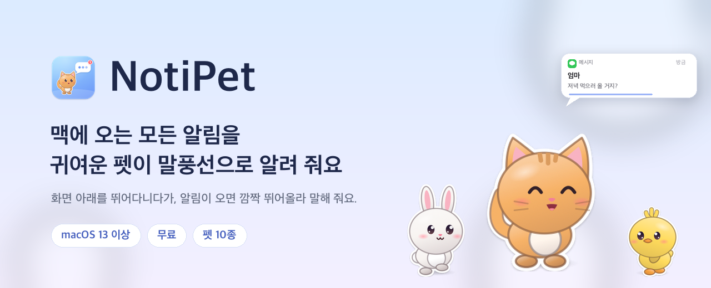
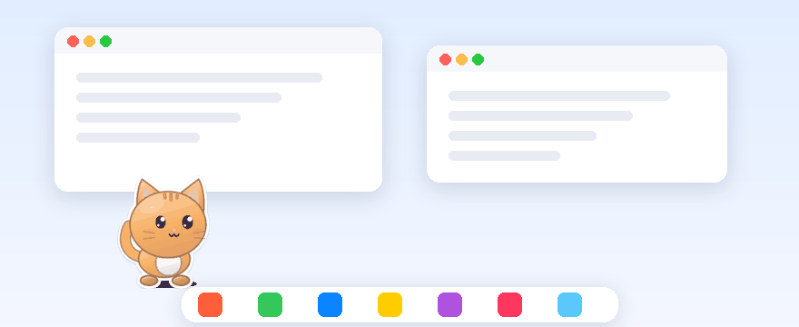
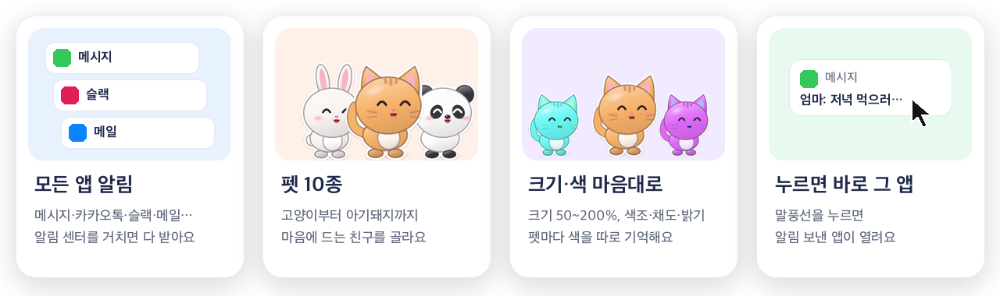
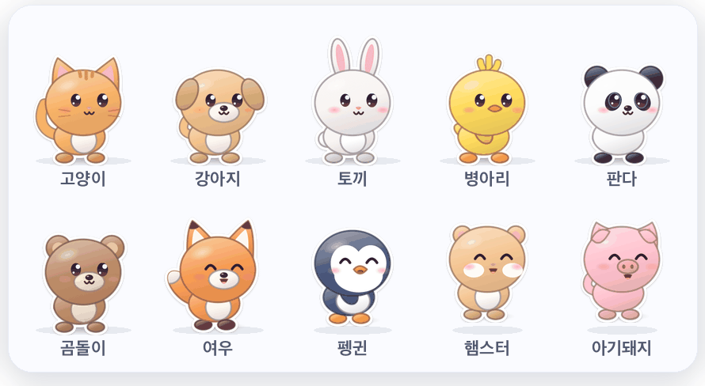
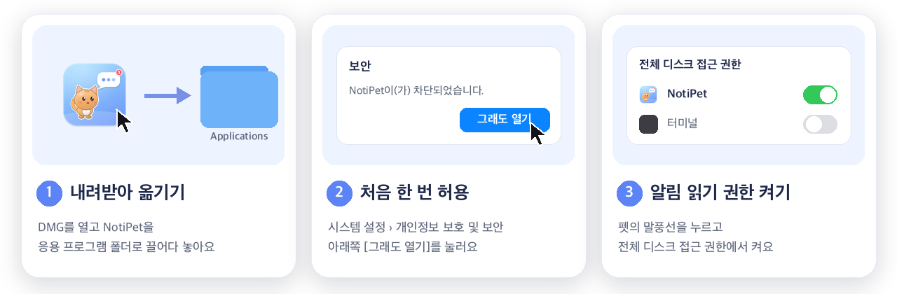
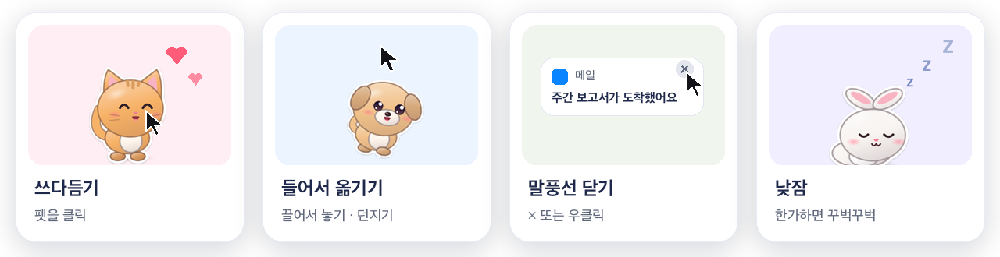
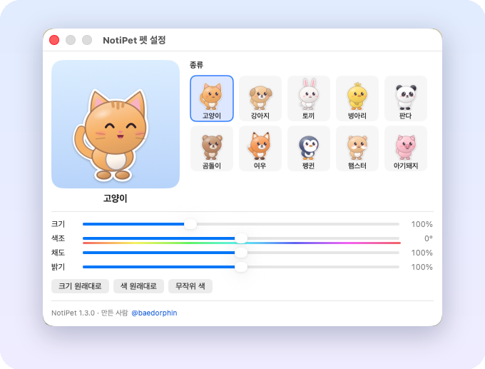
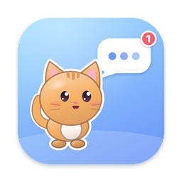

  

  
  
  
  

 

  

  펫이 화면 아래를 걸어 다니다가, 알림이 오면 <b>깜짝 뛰어올라 말풍선으로 알려 줘요.</b> 
  말풍선을 누르면 알림을 보낸 앱이 바로 열려요.

 

 

## 🐾 누구랑 지낼래요?

  

 

## ⬇️ 설치는 3단계

1. **[내려받기](#-버전별-내려받기)** → DMG를 열고 NotiPet을 **응용 프로그램** 폴더로 끌어다 놓아요.
2. NotiPet을 열면 경고가 떠요. 닫고 **시스템 설정 › 개인정보 보호 및 보안** 맨 아래에서 **그래도 열기**를 눌러요. *(처음 한 번만)*
3. 펫이 "권한이 필요해요"라고 말하면 **말풍선을 누르고**, **전체 디스크 접근 권한**에서 NotiPet을 켜요. 몇 초 뒤 "이제 알림이 보여요!" 하면 끝!

> 🔑 **2.0부터 유료예요.** 처음 열면 키 입력 창이 떠요. [notipet.sanghak.kr](https://notipet.sanghak.kr/#buy)에서 **이메일을 남겨 구매 신청**하면, 그 이메일 전용 키를 보내 드려요. 앱에는 이메일과 키를 함께 넣어요. 
> 키 없이 쓰고 싶다면 **1점대 버전**을 받으세요. 계속 무료예요.

> 🔒 **안심하세요.** NotiPet은 macOS가 저장해 둔 알림을 **읽기만** 해요. 아무것도 바꾸지 않고, 인터넷에 연결하지도 않아요.

 

## 📦 버전별 내려받기

| 버전 | 가격 | 바뀐 점 | 내려받기 |
| :-- | :-- | :-- | :-- |
| **2.1.0** (최신) | 🔑 유료 · 키 필요 | 키가 구매자 이메일에 묶여요. 입력 창에서 이메일과 키를 함께 넣어요 | [NotiPet-2.1.0.dmg](https://github.com/sanghakbae/Noti-Pet/releases/download/v2.1.0/NotiPet-2.1.0.dmg) |
| 1.3.0 | 🆓 무료 | 토끼 귀·병아리 깃털 끝이 잘려 보이던 문제를 고쳤어요 | [NotiPet-1.3.0.dmg](https://github.com/sanghakbae/Noti-Pet/releases/download/v1.3.0/NotiPet-1.3.0.dmg) |
| 1.2.0 | 🆓 무료 | 첫 공개 · 펫 10종, 펫 설정 창(종류·크기·색) | [NotiPet-1.2.0.dmg](https://github.com/sanghakbae/Noti-Pet/releases/download/v1.2.0/NotiPet-1.2.0.dmg) |

구매 신청과 내려받기는 **[notipet.sanghak.kr](https://notipet.sanghak.kr/)** 에서도 할 수 있어요. 모든 버전과 바뀐 내용은 [Releases](https://github.com/sanghakbae/Noti-Pet/releases)에서 볼 수 있어요.

 

## 🎈 이렇게 놀아요

| 하고 싶은 것 | 방법 |
| :-- | :-- |
| 알림 보낸 앱 열기 | 말풍선 **클릭** |
| 말풍선 붙잡아 두기 | 말풍선에 **마우스 올리기** |
| 말풍선 닫기 | **×** 또는 **우클릭** |
| 쓰다듬기 💕 | 펫 **클릭** |
| 옮기기 · 던지기 | 펫을 **끌어서 놓기** (다른 모니터도 OK) |
| 메뉴 열기 | 메뉴바 **🐾** 또는 펫 **우클릭** |

 

## 🎨 나만의 펫 꾸미기

메뉴바 🐾 › **펫 설정…** 에서 종류·크기·색을 바꿔요. 바꾸는 즉시 화면의 펫에 반영돼요.

  

- **크기** 50~200% · **색조** 무지개처럼 털색 돌리기 · **채도** · **밝기**
- 색은 **펫마다 따로 기억해요.** 고양이를 보라색으로 바꿔도 강아지는 그대로예요.
- 고민되면 **무작위 색** 🎲

 

## 📋 메뉴 한눈에 보기

<b>메뉴바 🐾 메뉴 전체 설명 펼치기</b>

 

| 메뉴 | 하는 일 |
| :-- | :-- |
| **최근 알림** | 최근 15개. 항목마다 *다시 말해 줘* · *이 앱 알림 무시하기* |
| **무시하는 앱** | 무시 중인 앱 목록. 누르면 다시 받아요 |
| **말풍선 잠시 끄기** | 회의·발표 중에 켜 두세요. 펫은 그대로, 말풍선만 쉬어요 |
| **펫 설정… / 펫 바꾸기** | 종류·크기·색 바꾸기 |
| **활발함** | 느긋하게 · 보통 · 신나게 |
| **말풍선 시간** | 짧게 4초 · 보통 7초 · 길게 12초 (글이 길면 조금 더) |
| **테스트 알림 보내기** | 말풍선이 어떻게 뜨는지 바로 보기 |
| **로그인 시 자동 실행** | 맥을 켜면 펫도 같이 출근 |
| **NotiPet 정보 / 종료** | 버전 정보 · 펫 퇴근시키기 |

## 🙋 자주 묻는 질문

<b>키는 어디서 받아요? 꼭 있어야 해요?</b>

 
<b>2.0부터</b> 유료라서 키가 있어야 실행돼요. <a href="https://notipet.sanghak.kr/#buy">notipet.sanghak.kr</a>에서 이메일을 남겨 구매 신청하면 그 이메일 전용 키를 보내 드려요. 키 입력 창의 <b>구매하기</b> 버튼을 눌러도 돼요. 앱에는 <b>이메일과 키를 함께</b> 넣고, 한 번 넣으면 다시 묻지 않아요. 
키 없이 쓰고 싶다면 <a href="#-버전별-내려받기">1점대 버전</a>을 받으세요. 계속 무료예요.

<b>말풍선이 알림 배너보다 조금 늦게 떠요</b>

 
macOS가 알림을 저장하는 데 몇 초 걸려서 배너보다 <b>약 5초</b> 늦게 떠요. 정상이에요.

<b>시스템 배너랑 말풍선이 둘 다 떠요</b>

 
배너는 macOS가 띄우는 거라 NotiPet이 끌 수 없어요. 펫 말풍선만 보고 싶다면 <b>시스템 설정 › 알림</b>에서 앱별 알림 스타일을 <b>없음</b>으로 바꾸고, <b>알림 센터에 표시</b>는 켜 두세요.

<b>어떤 앱의 알림만 안 와요</b>

 

- **시스템 설정 › 알림**에서 그 앱 알림이 켜져 있는지 확인해요.
- 메뉴 › **무시하는 앱**에 들어 있지 않은지 확인해요.
- 앱 창 안에서만 뜨는 자체 팝업은 macOS 알림이 아니라서 받을 수 없어요.

<b>권한을 켰는데도 "권한이 필요해요"라고 해요</b>

 
<b>전체 디스크 접근 권한</b> 목록에서 NotiPet을 <b>−</b> 로 뺀 뒤 <b>+</b> 로 다시 추가하고, NotiPet을 껐다 켜 주세요. 업데이트한 뒤에도 이렇게 한 번 해 주면 돼요.

<b>펫이 사라졌어요</b>

 
모니터 연결이 바뀌면 다른 화면으로 갈 수 있어요. 메뉴바에 🐾가 있으면 실행 중이에요. 껐다 켜면 화면 가운데로 떨어지며 돌아와요.

<b>업데이트 · 삭제는 어떻게 해요?</b>

 

- **업데이트:** 새 DMG로 응용 프로그램 폴더의 NotiPet을 덮어써요. 전체 디스크 접근 권한을 다시 켜야 할 수 있어요. 1점대에서 2점대로 올리면 이메일과 키를 한 번 넣어야 해요.
- **삭제:** 메뉴 › 종료 → NotiPet을 휴지통으로 → 전체 디스크 접근 권한 목록에서 **−** 로 빼기. 설정까지 지우려면 터미널에서 `defaults delete kr.sanghak.notipet`

 

---

   
  <b>NotiPet</b> · macOS 13 이상 · Apple 실리콘 / Intel 
  만든 사람 <a href="https://www.threads.com/@baedorphin">@baedorphin</a> · 의견과 버그는 <a href="https://github.com/sanghakbae/Noti-Pet/issues">Issues</a>로 알려 주세요 🐾

