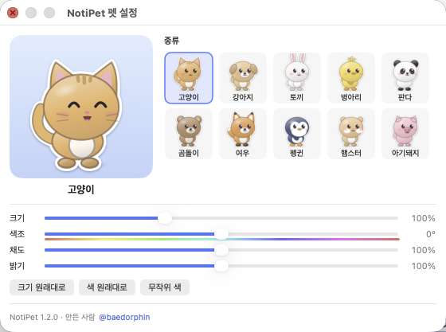

<h1 align="center">NotiPet</h1>

맥 화면 아래를 뛰어다니는 귀여운 펫이 맥에 오는 <b>모든 알림</b>을 말풍선으로 알려 드려요.

<a href="https://github.com/sanghakbae/Noti-Pet/releases/latest"><b>⬇︎ 최신 버전 내려받기 (DMG)</b></a>

## 목차

1. [펫 소개](#펫-소개)
2. [설치](#설치)
3. [처음 설정: 알림 읽기 권한](#처음-설정-알림-읽기-권한)
4. [사용법](#사용법)
5. [펫 설정: 종류·크기·색](#펫-설정-종류크기색)
6. [메뉴 안내](#메뉴-안내)
7. [자주 묻는 질문](#자주-묻는-질문)
8. [업데이트와 삭제](#업데이트와-삭제)

## 펫 소개

펫은 10종이에요: 고양이, 강아지, 토끼, 병아리, 판다, 곰돌이, 여우, 펭귄, 햄스터, 아기돼지.

펫은 화면 맨 아래(Dock 바로 위)에서 혼자 걷고, 뛰고, 점프하고, 앉아서 쉬어요. 한동안 아무 일이 없으면 꾸벅꾸벅 잠들기도 해요.

## 설치

1. [Releases](https://github.com/sanghakbae/Noti-Pet/releases/latest)에서 `NotiPet-<버전>.dmg`를 내려받아요.
2. DMG를 열고 **NotiPet**을 옆의 **응용 프로그램(Applications)** 폴더로 끌어다 놓아요.
3. 응용 프로그램 폴더에서 NotiPet을 열어요.
4. "Apple에서 확인할 수 없습니다" 경고가 뜨면 **완료**를 눌러 닫아요.
5. **시스템 설정 › 개인정보 보호 및 보안**으로 가요. 아래쪽 "NotiPet이(가) 차단되었습니다" 옆의 **그래도 열기**를 누르고, 한 번 더 **그래도 열기**를 눌러요.

> NotiPet은 Apple 공증을 받지 않은 개인 배포 앱이라 처음 한 번은 이 과정이 필요해요. 두 번째부터는 바로 열려요.

실행하면 메뉴바에 🐾 아이콘이 생기고, 화면 위쪽에서 펫이 뛰어내려와요. Dock에는 아이콘이 나타나지 않아요.

## 처음 설정: 알림 읽기 권한

macOS에는 다른 앱의 알림을 받아 보는 기능이 따로 없어요. 그래서 NotiPet은 macOS가 알림을 저장해 두는 곳을 읽고, 그러려면 **전체 디스크 접근 권한**이 필요해요.

1. 처음 실행하면 펫이 "전체 디스크 접근 권한이 필요해요"라고 말해요. **그 말풍선을 눌러요.**
2. 열린 **시스템 설정 › 개인정보 보호 및 보안 › 전체 디스크 접근 권한**에서 **NotiPet** 스위치를 켜요.
   - 목록에 NotiPet이 없으면 아래 **+** 버튼을 눌러 응용 프로그램 폴더의 NotiPet을 추가해요.
3. 몇 초 기다리면 펫이 "이제 알림이 보여요!"라고 말해요. 설정 끝이에요.

**개인정보:** NotiPet은 알림을 읽기만 하고 아무것도 바꾸지 않아요. 알림 내용을 어디로도 보내지 않고, 인터넷에 연결하지도 않아요.

## 사용법

### 알림이 오면

알림이 오면 펫이 깜짝 놀라 뛰어오르고(❗), 착지해서 **오른쪽 위**에 말풍선을 띄워요. 화면 오른쪽 끝이라 자리가 없으면 왼쪽 위에 띄워요.

- 말풍선에는 **앱 아이콘, 앱 이름, 제목, 부제목, 본문**이 나와요.
- 말풍선 아래쪽의 파란 막대가 남은 시간이에요. 다 줄어들면 저절로 사라져요.
- 알림이 여러 개 밀려 있으면 오른쪽 위에 `+2`처럼 남은 개수가 보이고, 차례대로 하나씩 보여 줘요.

| 말풍선에서 | 결과 |
| --- | --- |
| **클릭** | 알림을 보낸 앱이 열리고 다음 알림으로 넘어가요 |
| **마우스 올리기** | 사라지지 않고 기다려요. 오른쪽 위에 × 버튼이 나와요 |
| **× 또는 우클릭** | 앱을 열지 않고 닫아요 |

### 펫과 놀기

| 펫에게 | 결과 |
| --- | --- |
| **클릭** | 쓰다듬기. 하트가 뿅 나오고 신나 해요 |
| **끌어서 옮기기** | 들어 올리면 버둥거리고, 놓으면 떨어져서 착지해요. 다른 모니터로도 옮길 수 있어요 |
| **던지기** | 끌다가 빠르게 놓으면 날아가요 |
| **우클릭** | 메뉴가 열려요(메뉴바 🐾와 같아요) |

## 펫 설정: 종류·크기·색

메뉴바 🐾 › **펫 설정… (종류·크기·색)** 을 열어요.

- **종류:** 오른쪽 목록에서 고르면 바로 바뀌어요. 왼쪽 미리보기에서 움직이는 모습을 볼 수 있어요.
- **크기:** 50%~200%. 화면이 넓으면 크게, 작업에 방해되면 작게 두세요.
- **색조:** 털색을 무지개 방향으로 돌려요. 주황 고양이를 민트나 보라 고양이로 바꿀 수 있어요.
- **채도:** 0%는 흑백, 200%는 아주 선명한 색이에요.
- **밝기:** 50%~150%.
- **크기 원래대로 / 색 원래대로 / 무작위 색** 버튼으로 한 번에 바꿀 수 있어요.

색은 **펫마다 따로 기억**해요. 고양이를 보라색으로 바꿔도 강아지는 원래 색 그대로예요.

## 메뉴 안내

메뉴바의 🐾를 누르거나 펫을 우클릭하면 열려요.

| 메뉴 | 설명 |
| --- | --- |
| 알림 감시 중 | 지금 상태예요. 권한이 없으면 "⚠️ 전체 디스크 접근 권한 필요"로 바뀌고, 누르면 설정이 열려요 |
| 최근 알림 | 최근 15개 알림 목록이에요. 항목마다 **다시 말해 줘**, **이 앱 알림 무시하기**가 있어요 |
| 무시하는 앱 | 무시하도록 설정한 앱 목록이에요. 누르면 다시 알림을 받아요 |
| 말풍선 잠시 끄기 | 회의나 발표 중에 켜 두세요. 펫은 그대로 돌아다니고 말풍선만 안 떠요 |
| 펫 설정… | 종류·크기·색을 바꾸는 창을 열어요 |
| 펫 바꾸기 | 설정 창을 열지 않고 종류만 바로 바꿔요 |
| 활발함 | 느긋하게 / 보통 / 신나게. 펫이 움직이는 속도와 뛰어다니는 정도예요 |
| 말풍선 시간 | 짧게(4초) / 보통(7초) / 길게(12초). 글이 길면 조금 더 오래 떠 있어요 |
| 테스트 알림 보내기 | 말풍선이 어떻게 뜨는지 바로 확인해요 |
| 로그인 시 자동 실행 | 맥을 켜면 NotiPet이 저절로 실행돼요 |
| 전체 디스크 접근 권한 설정 열기… | 권한 설정 화면으로 바로 가요 |
| NotiPet 정보 | 버전과 만든 사람 정보 |
| NotiPet 종료 | 펫을 집으로 보내요 |

## 자주 묻는 질문

**말풍선이 알림 배너보다 늦게 떠요.**
macOS가 알림을 저장소에 기록하는 데 몇 초 걸려서, 배너보다 약 5초 늦게 떠요. 정상이에요.

**시스템 알림 배너와 말풍선이 둘 다 떠요.**
배너는 macOS가 띄우는 거라 NotiPet이 끌 수 없어요. 펫 말풍선만 보고 싶다면 **시스템 설정 › 알림**에서 앱별 알림 스타일을 **없음**으로 바꿔 보세요. 이때 "알림 센터에 표시"는 켜 둬야 해요.

**어떤 앱의 알림이 안 와요.**
- 시스템 설정 › 알림에서 그 앱의 알림이 켜져 있는지 확인해요. 꺼 둔 앱의 알림은 NotiPet도 받을 수 없어요.
- 메뉴 › **무시하는 앱**에 그 앱이 있는지 확인해요.
- 앱 창 안에서만 뜨는 자체 팝업은 macOS 알림이 아니라서 받을 수 없어요.

**펫이 "전체 디스크 접근 권한이 필요해요"라고 계속 말해요.**
시스템 설정 › 개인정보 보호 및 보안 › 전체 디스크 접근 권한에서 NotiPet이 켜져 있는지 확인해요. 켜져 있는데도 그렇다면 목록에서 NotiPet을 **−** 버튼으로 뺀 뒤 **+** 로 다시 추가하고, NotiPet을 종료했다가 다시 열어요.

**펫이 전체 화면 영상이나 발표 화면 위에 보여요.**
펫은 모든 화면 위에 떠 있어요. 잠시 치우려면 메뉴 › **NotiPet 종료**를 누르고 나중에 다시 열어요. 말풍선만 끄려면 **말풍선 잠시 끄기**를 써요.

**펫이 사라졌어요.**
모니터 연결을 바꾸면 펫이 다른 화면으로 갈 수 있어요. 메뉴바 🐾가 보이면 실행 중이에요. 종료했다가 다시 열면 화면 가운데로 떨어지며 돌아와요.

## 업데이트와 삭제

**업데이트:** 새 DMG를 받아 응용 프로그램 폴더의 NotiPet을 덮어써요. 새 버전은 서명이 바뀌어서 **전체 디스크 접근 권한을 다시 켜야 할 수 있어요.** 목록에서 NotiPet을 빼고 다시 추가하면 확실해요.

**삭제:**
1. 메뉴 › **NotiPet 종료**
2. 응용 프로그램 폴더의 NotiPet을 휴지통으로 옮겨요.
3. 시스템 설정 › 전체 디스크 접근 권한 목록에서 NotiPet을 **−** 로 빼요.
4. 설정까지 지우려면 터미널에서 `defaults delete kr.sanghak.notipet`을 실행해요.

---

**시스템 요구 사항:** macOS 13 Ventura 이상 (Apple 실리콘, Intel 모두 지원)

만든 사람 [@baedorphin](https://www.threads.com/@baedorphin) · 의견이나 버그는 [Issues](https://github.com/sanghakbae/Noti-Pet/issues)에 남겨 주세요.
